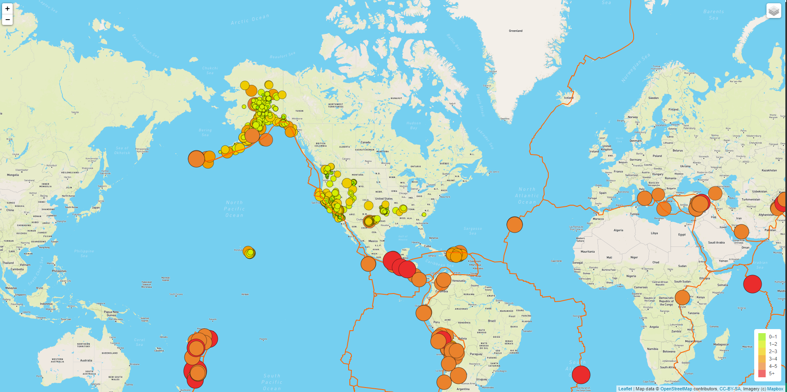
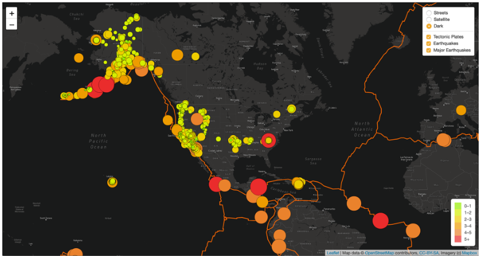

# Mapping_Earthquakes

## Basic Project Plan

### Purpose

The purpose of this project is to visually show the differences between the magnitudes of earthquakes all over the world for the last seven days.

### Tasks

Use a URL for GeoJSON earthquake data from the USGS website and retrieve geographical coordinates and the magnitudes of earthquakes for the last seven days. Then add the data to a map.

### Approach

- Use the JavaScript and the D3.js library to retrieve the coordinates and magnitudes of the earthquakes from the GeoJSON data. 
- Use the Leaflet library to plot the data on a Mapbox map through an API request and create interactivity for the earthquake data.

## Deliverable 1

### Add Tectonic Plate Data

- The tectonic plate data is added as a second layer group.
- The tectonic plate data is added to the overlay object.
- The d3.json() callback is working and does the following:
- The tectonic plate data is passed to the geoJSON() layer
- The geoJSON() layer adds color and width to the tectonic plate lines
- The tectonic layer group variable is added to the map
- The earthquake data and tectonic plate data displayed on the map when the page loads.

## Deliverable 2

### Add Major Earthquake Data

- The major earthquake data is added as a third layer group.
- The major earthquake data is added to the overlay object.
- The d3.json() callback is working and does the following:
- Sets the color and diameter of each earthquake.
- The major earthquake data is passed to the geoJSON() layer.
- The geoJSON() layer creates a circle for each major earthquake, and adds a popup for each circle to display the magnitude and location of the earthquake
- The major earthquake layer group variable is added to the map
- All the earthquake data and tectonic plate data are displayed on the map when the page loads and the datasets can be toggled on or off.

## Deliverable 3

### Add an Additional Map

- A third map tile layer is created.
- The third map is added to the overlay object.
- All the earthquake data and tectonic plate data are displayed on the all maps of the webpage.

